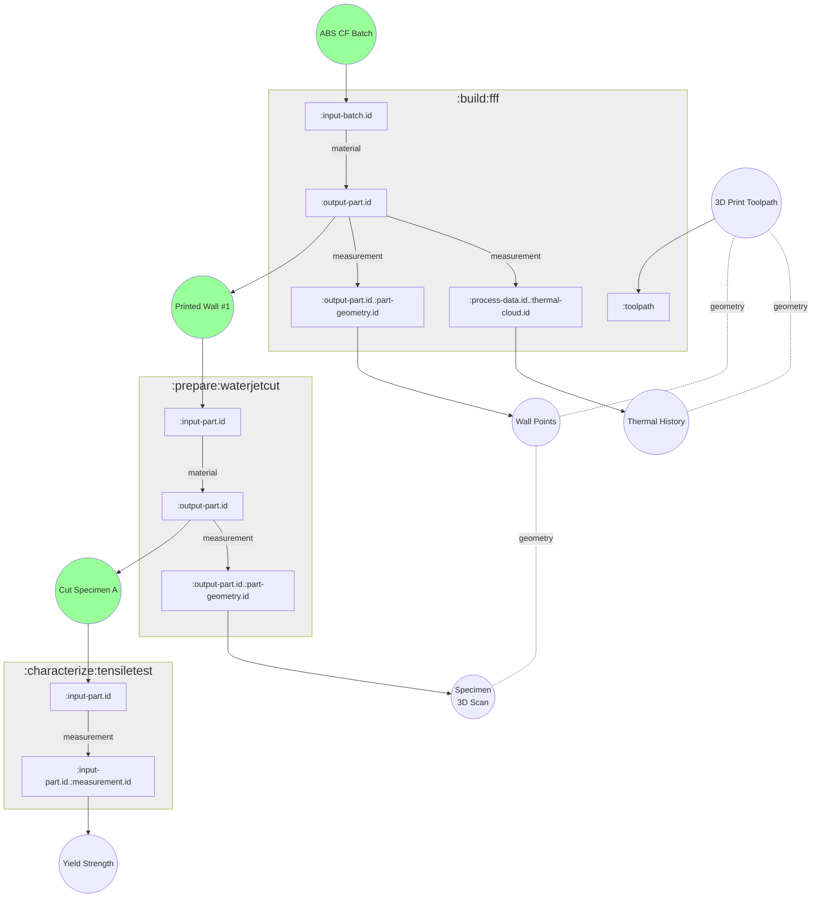
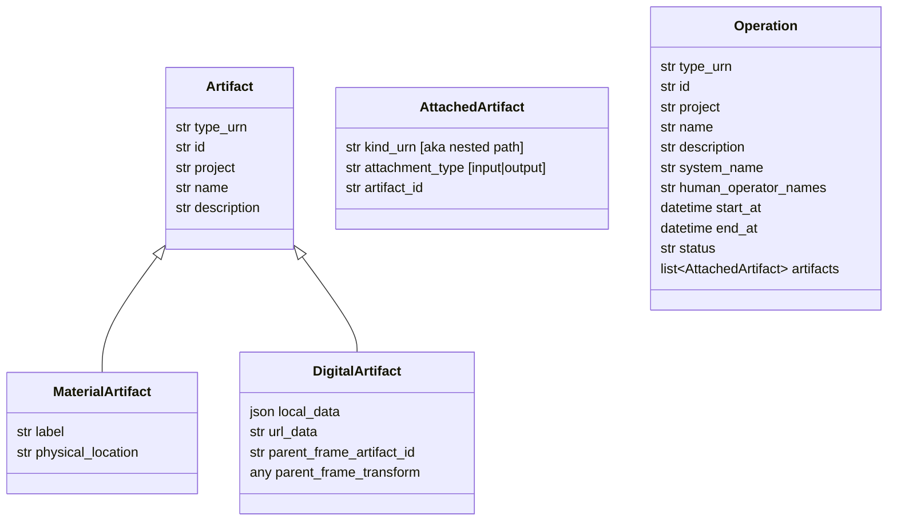
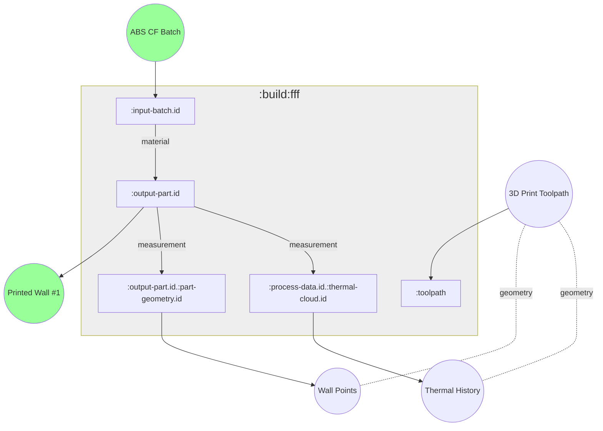

# Material Process-Property Warehouse Architecture

## Goals

The goal of the Material Process-Property Warehouse (MPPW) is to track data collected during manufacturing processes and associate that data with the results of testing done on the manufactured parts.  In general, multiple manufacturing *operations* are required to produce a useful test *artifact*, and the manufacturing history of a test artifact over these operations is the artifact's *provenance*.  For example:

* A flat panel is manufactured by a 3D Printing (FFF) operation
    * The 3D print operation takes batches of material as input
    * A thermal camera feed of the print process is recorded
    * The 3D print operation creates a flat panel artifact
* The flat panel is cut into several test specimens
    * The flat panel artifact is input
    * The test specimen artifacts are output with new geometry
* The test specimens are tested for tensile strength
    * One or more test specimen artifacts are input
    * The strain response to tensile stress is recorded, as well as yield strength



Given the manufacturing process and material property test above, the MPPW must support the following kinds of queries:

* Find the thermal process data relevant to a particular test specimen (work backwards in provenance)
* Project the geometry of that test specimen back into the coordinate system of the thermal process data (transform geometry through artifacts)
* Find all yield strength results for parts printed with a particular batch material (work forwards in provenance)


The overall idea is simple - just store the relevant data for all manufacturing and test operations.   The technical and design challenge is really in the huge variety in semi-structured data that needs to be stored.  In addition, manufacturing research requires high flexibility in data collection.  It's the norm, not the exception, that we'll be collecting a novel set of data when running an experiment.

## Data Storage

Currently the MPPW uses MongoDB as both the application- and process- data storage engine.  The choice of MongoDB was made for a number of reasons, but probably the most important was the ability to quickly store unstructured sensor information, large binary files, and indexed metadata in the same scalable location.  This simplifies deployments significantly, especially since cybersecurity considerations require that on-premise blob stores are available.  A secondary consideration is the transparent-scaling features of MongoDB - this is a core requirement not only for large data storage but also, independently, to de-risk high speed data collection at the sensor level.

### Schema flexibility

The schema flexibility of MongoDB also dovetails with the flexibility required when storing research data.  In particular, a predefined tabular/relational representation of a manufacturing operation doesn't allow for flexibly-configured data collection - a configurable tree or graph structure is required.  This is of course possible in a relational database but is more naturally realized in MongoDB documents.

The other standard advantage to schema flexiblity in a data warehouse is ease of working with historical data - generally schemas change over time, and this cannot be captured easily in a single static schema.

### Alternatives

It is important to note that the MPPW API uses a repository interface to allow data storage changes in the future.  It would be fairly simple to write a Postgres repository layer with the same functionality as the MongoDB repository layer, for example, if required.

One of the trade-offs of using MongoDB is the lack of access to tools and huge ecosystem around relational databases.  In addition, the negative flip-side of configurable data fields is that large data sets must be normalized as part of analysis.

## Provenance Data Structure

To support provenance graphs like the one above, a schema is defined for storing data and metadata artifacts attached to the (manufacturing) operations which produce and measure them.  The overall structure is very basic, as seen below:



There is very little structure embedded in the storage schema itself - digital artifacts can store any kind of data or reference any external data, and operations can attach any kind of artifacts in whatever hierarchy is most appropriate.  The core idea is that operations and artifacts are *configurable*, and there is a meta-schema that further defines the attachment structure of operations and the data formats of artifacts.  The meta-schema is applied based on the *type_urn* of the artifact or operation, and is enforced at the service layer of the API.

* The attachment structure of operations is defined by a (nested) map of named attachment "kinds" to artifact types - one way to think of it is as a tree that only allows certain types of data at each node.
* The data field used (local/remote url) by digital artifacts is determined by the service layer, and local-data artifacts may have JSON schemas defined over the local data.

> Currently the JSON schemas are applied at the UI level - this is not correct and should be push downward to API calls which can return local data schemas (or none) for any artifact type.

### Type URNs

The type URNs used by the MPPW share a common prefix of "urn:x-mfg" - the intention is to allow for standardization of artifact types beyond the MPPW and for use in other organizations.  There are other "digital thread" and provenance-tracking initiatives elsewhere, and a well-defined name for certain kinds of operations and measurements in theory will help us exchange these artifacts.

Overall, there are several main prefixes used:

```
urn:x-mfg:artifact:material[:part|:batch]
urn:x-mfg:artifact:digital[:file|:point-cloud]

urn:x-mfg:operation:build[:fff]
urn:x-mfg:operation:prepare[:waterjetcut]
urn:x-mfg:operation:characterize[:tensiletest]
```

### Provenance Edges

* Find the thermal process data relevant to a particular test specimen (work backwards in provenance)
* Find all yield strength results for parts printed with a particular batch material (work forwards in provenance)



At the highest level, a provenance is constructed by artifacts connected through sub-graphs of operations.  Operations provide the material and measurement relationships between artifacts.  These relationships are implicit - operation-specific logic is required to transform the tree of artifact attachments into a subgraph of material relationships.  The core logic is really that manufacturing operations as a whole can perform arbitrarily complex transformations on input materials to outputs - in the 3D printing FFF example, every output part may contain material from every input batch of material, which is not representable as a single hierarchy of batches and output parts.  In a similar way, a single thermal cloud may record the process data for multiple output parts.  More complex examples can also be imagined.

A provenance graph is "explored" then by starting from an artifact and working backwards or forwards through operations referencing that artifact.  In an operation, material artifacts have their material used to make other material artifacts or can have additional measurements of any kind made.  Digital artifacts can also "measure" or aggregate the results from other digital artifacts (though this has not been fully explored).

> NOTE that while currently this is not done, it would be possible to store the operation-specific artifact relationships as metadata in operations themselves when operation artifacts change.  This way graph traversal could be done at the data storage layer if required instead of the "lazy" approach currently targeted.

### Geometric Relationships

* Project the geometry of a test specimen back into the coordinate system of the thermal process data (transform geometry through artifacts)

To support geometric queries between different artifacts a "geometric" provenance must also be created - this provenance is logically separate from the operation-specific measurement and material relationships.  A spatial measurement of any kind has a coordinate system inherent to the measurement itself, for example, a :point-cloud has XYZ points in some space.  We call this coordinate system the "spatial frame".  There is only one spatial frame for any spatial measurement - even if a measurement (for example, a :mesh describing the bounds of a part) was used in multiple manufacturing operations the spatial frame of the measurement is fixed at creation.

The spatial frame of an artifact, though fixed, can be related to another "parent" artifact's spatial frame by a transform of some kind (currently only affine transforms are handled by the API / web UI).  The tree of these relationships forms a geometric provenance that can be explored to execute spatial queries between different spatial artifacts.  For example, we can use the :mesh of a part specimen to query the :point-cloud thermal data of the specimen's ancestor :build operation.

#### Fiducial points

Only :digital artifacts have a spatial frame - :material artifacts only have a label and human-readable location.  This doesn't mean that :material artifacts don't have a geometry, just that you need to *measure* the geometry and express the results in a particular coordinate frame, which results in a :digital measurement attached to the :material artifact in some kind of an operation.  Another way of thinking of this is that the geometry of :material artifacts can be measured in *many* spatial frames.

The :fiducial-points measurement artifact is an interesting case here as it is the link between the digital measurements of a :material part and the "real-world" use of those measurements.  If, for example, we want to physically inspect a 3D-printed wall at the positions where the extrusion was the "hottest", we could query for the hottest positions based on the process data in a thermal :point-cloud.  Somehow, though, we need to take a "hot" coordinate and actually find it on the physical wall - we do this by referencing easily-identified physical features that also have coordinates.  Fiducial points are these easily-identified features and coordinates - they ensure that there is always a way to take future measurements in the real world relative to existing data.
