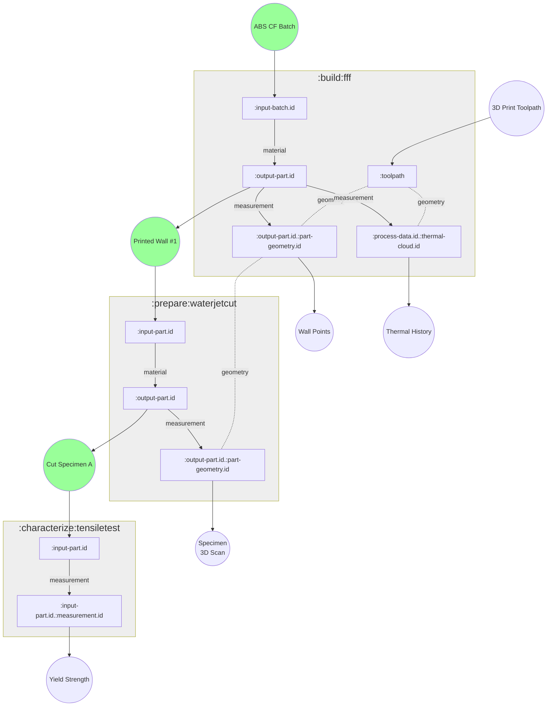

# Material Process-Property Warehouse Architecture

## Goals

The goal of the Material Process-Property Warehouse (MPPW) is to track data collected during manufacturing processes and associate that data with the results of testing done on the manufactured parts.  In general, multiple manufacturing *operations* are required to produce a useful test *artifact*, and the manufacturing history of a test artifact over these operations is the artifact's *provenance*.  For example:

* A flat panel is manufactured by a 3D Printing (FFF) operation
    * The 3D print operation takes batches of material as input
    * A thermal camera feed of the print process is recorded
    * The 3D print operation creates a flat panel artifact
* The flat panel is cut into several test specimens
    * The flat panel artifact is input
    * The test specimen artifacts are output with new geometry
* The test specimens are tested for tensile strength
    * One or more test specimen artifacts are input
    * The strain response to tensile stress is recorded, as well as yield strength

Given the manufacturing process and material property test above, the MPPW must support the following kinds of queries:

* Find the thermal process data relevant to a particular test specimen (work backwards in provenance)
* Find all yield strength results for parts printed with a particular batch material (work forwards in provenance)
* Generally return the full provenance of any artifact for use in further analysis 

The overall idea is simple - just store the relevant data for all manufacturing and test operations.   The technical and design challenge is really in the huge variety in semi-structured data that needs to be stored.  In addition, manufacturing research requires high flexibility in data collection.  It's the norm, not the exception, that we'll be collecting a novel set of data when running an experiment.

## Data Storage

Currently the MPPW uses MongoDB as both the application- and process- data storage engine.  The choice of MongoDB was made for a number of reasons, but probably the most important was the ability to quickly store unstructured sensor information, large binary files, and indexed metadata in the same scalable location.  This simplifies deployments significantly, especially since cybersecurity considerations require that on-premise blob stores are available.  A secondary consideration is the transparent-scaling features of MongoDB - this is a core requirement not only for large data storage but also, independently, to de-risk high speed data collection at the sensor level.

### Schema flexibility

The schema flexibility of MongoDB also dovetails with the flexibility required when storing research data.  In particular, a predefined tabular/relational representation of a manufacturing operation doesn't allow for flexibly-configured data collection - a configurable tree or graph structure is required.  This is of course possible in a relational database but is more naturally realized in MongoDB documents.

The other standard advantage to schema flexiblity in a data warehouse is ease of working with historical data - generally schemas change over time, and this cannot be captured easily in a single static schema.

### Alternatives

It is important to note that the MPPW API uses a repository interface to allow data storage changes in the future.  It would be fairly simple to write a Postgres repository layer with the same functionality as the MongoDB repository layer, for example, if required.

One of the trade-offs of using MongoDB is the lack of access to tools and huge ecosystem around relational databases.  In addition, the negative flip-side of configurable data fields is that large data sets must be normalized as part of analysis.

## Provenance Data Structure

# TODO