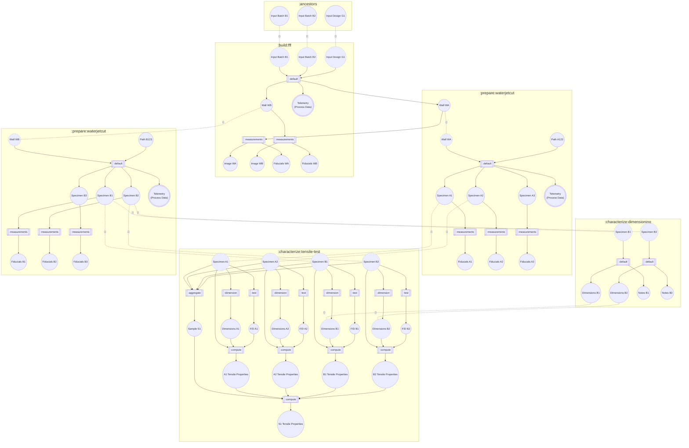

```mermaid
graph TD;

subgraph ancestors[<font size=5> :ancestors]
    input_batch_B1((Input Batch B1))
    input_batch_B2((Input Batch B2))
    input_design_G1((Input Design G1))
end

subgraph wjcut_A[<font size=5> :prepare:waterjetcut]
    
    _output_wall_WA((Wall WA))
    style _output_wall_WA stroke-dasharray:5;

    output_wall_WA -.- |"🔗"| _output_wall_WA

    wjcut_A_path_A123((Path A123))
    
    wjcut_A_default[[:default]]

    specimen_A1((Specimen A1))
    specimen_A2((Specimen A2))
    specimen_A3((Specimen A3))
    wjcut_A_telemetry((("Telemetry\n(Process Data)")))

    _output_wall_WA --> wjcut_A_default
    wjcut_A_path_A123 --> wjcut_A_default
    
    wjcut_A_default --> specimen_A1
    wjcut_A_default --> specimen_A2
    wjcut_A_default --> specimen_A3
    wjcut_A_default --> wjcut_A_telemetry
    
    measurements_A1[[:measurements]]
    measurements_A2[[:measurements]]
    measurements_A3[[:measurements]]
    
    fiducials_A1((Fiducials A1))
    fiducials_A2((Fiducials A2))
    fiducials_A3((Fiducials A3))
    
    specimen_A1 --> measurements_A1
    measurements_A1 --> fiducials_A1

    specimen_A2 --> measurements_A2
    measurements_A2 --> fiducials_A2
    
    specimen_A3 --> measurements_A3
    measurements_A3 --> fiducials_A3

end


subgraph fff[<font size=5> :build:fff]

    _input_batch_B1((Input Batch B1))
    style _input_batch_B1 stroke-dasharray:5;
    _input_batch_B2((Input Batch B2))
    style _input_batch_B2 stroke-dasharray:5;
    _input_design_G1((Input Design G1))
    style _input_design_G1 stroke-dasharray:5;

    input_batch_B1 -.- |"🔗"| _input_batch_B1
    input_batch_B2 -.- |"🔗"| _input_batch_B2
    input_design_G1 -.- |"🔗"| _input_design_G1

    fff_default[[:default]]

    output_wall_WA((Wall WA))
    output_wall_WB((Wall WB))
    fff_telemetry((("Telemetry\n(Process Data)")))

    _input_batch_B1 --> fff_default
    _input_batch_B2 --> fff_default
    _input_design_G1 --> fff_default
    
    fff_default --> output_wall_WA
    fff_default --> output_wall_WB
    fff_default --> fff_telemetry

    fff_measurements_WA[[:measurements]]
    fff_measurements_WB[[:measurements]]

    image_WA((Image WA))
    image_WB((Image WB))
    fiducials_WA((Fiducials WA))
    fiducials_WB((Fiducials WB))

    output_wall_WA --> fff_measurements_WA
    fff_measurements_WA --> image_WA
    fff_measurements_WA --> fiducials_WA

    output_wall_WB --> fff_measurements_WB
    fff_measurements_WB --> image_WB 
    fff_measurements_WB --> fiducials_WB
end


subgraph wjcut_B[<font size=5> :prepare:waterjetcut]

    specimen_B1((Specimen B1))
    specimen_B2((Specimen B2))
    specimen_B3((Specimen B3))

end

subgraph dim_B[<font size=5> :characterize:dimensioning]
    
    dim_B1((Dimensions B1))
    dim_B2((Dimensions B2))

end

subgraph tt[<font size=5> :characterize:tensile-test]

    _specimen_A1((Specimen A1))
    style _specimen_A1 stroke-dasharray:5;
    _specimen_A2((Specimen A2))
    style _specimen_A2 stroke-dasharray:5;
    _specimen_B1((Specimen B1))
    style _specimen_B1 stroke-dasharray:5;
    _specimen_B2((Specimen B2))
    style _specimen_B2 stroke-dasharray:5;

    specimen_A1 -.- |"🔗"| _specimen_A1
    specimen_A2 -.- |"🔗"| _specimen_A2
    specimen_B1 -.- |"🔗"| _specimen_B1
    specimen_B2 -.- |"🔗"| _specimen_B2
    
    dim_A1((Dimensions A1))
    dim_A2((Dimensions A2))
    
    _dim_B1((Dimensions B1))
    style _dim_B1 stroke-dasharray:5;
    _dim_B2((Dimensions B2))
    style _dim_B2 stroke-dasharray:5;

    dim_B1 -.- |"🔗"| _dim_B1
    dim_B2 -.- |"🔗"| _dim_B2

    tt_dim_A1[[:dimension]]
    tt_dim_A2[[:dimension]]
    tt_dim_B1[[:dimension]]
    tt_dim_B2[[:dimension]]

    _specimen_A1 --> tt_dim_A1
    tt_dim_A1 --> dim_A1
    _specimen_A2 --> tt_dim_A2
    tt_dim_A2 --> dim_A2
    _specimen_B1 --> tt_dim_B1
    tt_dim_B1 --> _dim_B1
    _specimen_B2 --> tt_dim_B2
    tt_dim_B2 --> _dim_B2

    fd_A1((F/D A1))
    fd_A2((F/D A2))
    fd_B1((F/D B1))
    fd_B2((F/D B2))

    tt_fd_A1[[:test]]
    tt_fd_A2[[:test]]
    tt_fd_B1[[:test]]
    tt_fd_B2[[:test]]

    _specimen_A1 --> tt_fd_A1
    tt_fd_A1 --> fd_A1
    _specimen_A2 --> tt_fd_A2
    tt_fd_A2 --> fd_A2
    _specimen_B1 --> tt_fd_B1
    tt_fd_B1 --> fd_B1
    _specimen_B2 --> tt_fd_B2
    tt_fd_B2 --> fd_B2

    tensile_properties_A1((A1 Tensile Properties))
    tensile_properties_A2((A2 Tensile Properties))
    tensile_properties_B1((B1 Tensile Properties))
    tensile_properties_B2((B2 Tensile Properties))
    
    tt_compute_A1[[:compute]]
    tt_compute_A2[[:compute]]
    tt_compute_B1[[:compute]]
    tt_compute_B2[[:compute]]

    _specimen_A1 --> tt_compute_A1
    dim_A1 --> tt_compute_A1
    fd_A1 --> tt_compute_A1
    tt_compute_A1 --> tensile_properties_A1
    _specimen_A2 --> tt_compute_A2
    dim_A2 --> tt_compute_A2
    fd_A2 --> tt_compute_A2
    tt_compute_A2 --> tensile_properties_A2
    _specimen_B1 --> tt_compute_B1
    _dim_B1 --> tt_compute_B1
    fd_B1 --> tt_compute_B1
    tt_compute_B1 --> tensile_properties_B1
    _specimen_B2 --> tt_compute_B2
    _dim_B2 --> tt_compute_B2
    fd_B2 --> tt_compute_B2
    tt_compute_B2 --> tensile_properties_B2

    sample((Sample S1))

    tt_aggregate[[:aggregate]]

    _specimen_A1 --> tt_aggregate
    _specimen_A2 --> tt_aggregate
    _specimen_B1 --> tt_aggregate
    _specimen_B2 --> tt_aggregate

    tt_aggregate --> sample

    tensile_properties((S1 Tensile Properties))

    tt_compute[[:compute]]

    sample --> tt_compute
    tensile_properties_A1 --> tt_compute
    tensile_properties_A2 --> tt_compute
    tensile_properties_B1 --> tt_compute
    tensile_properties_B2 --> tt_compute
    tt_compute --> tensile_properties


end


subgraph dim_B[<font size=5> :characterize:dimensioning]
    
    __specimen_B1((Specimen B1))
    style __specimen_B1 stroke-dasharray:5;
    __specimen_B2((Specimen B2))
    style __specimen_B2 stroke-dasharray:5;

    specimen_B1 -.- |"🔗"| __specimen_B1
    specimen_B2 -.- |"🔗"| __specimen_B2

    dim_B1_default[[:default]]
    dim_B2_default[[:default]]

    dim_B1((Dimensions B1))
    dim_B2((Dimensions B2))
    
    dim_B1_notes((Notes B1))
    dim_B2_notes((Notes B2))

    __specimen_B1 --> dim_B1_default
    dim_B1_default --> dim_B1
    dim_B1_default --> dim_B1_notes
    
    __specimen_B2--> dim_B2_default
    dim_B2_default --> dim_B2
    dim_B2_default --> dim_B2_notes

end

subgraph wjcut_B[<font size=5> :prepare:waterjetcut]
    
    _output_wall_WB((Wall WB))
    style _output_wall_WB stroke-dasharray:5;

    output_wall_WB -.- |"🔗"| _output_wall_WB

    wjcut_B_path_B123((Path B123))
    
    wjcut_B_default[[:default]]

    specimen_B1((Specimen B1))
    specimen_B2((Specimen B2))
    specimen_B3((Specimen B3))
    wjcut_B_telemetry((("Telemetry\n(Process Data)")))

    _output_wall_WB --> wjcut_B_default
    wjcut_B_path_B123 --> wjcut_B_default
    
    wjcut_B_default --> specimen_B1
    wjcut_B_default --> specimen_B2
    wjcut_B_default --> specimen_B3
    wjcut_B_default --> wjcut_B_telemetry
    
    measurements_B1[[:measurements]]
    measurements_B2[[:measurements]]
    measurements_B3[[:measurements]]
    
    fiducials_B1((Fiducials B1))
    fiducials_B2((Fiducials B2))
    fiducials_B3((Fiducials B3))
    
    specimen_B1 --> measurements_B1
    measurements_B1 --> fiducials_B1

    specimen_B2 --> measurements_B2
    measurements_B2 --> fiducials_B2
    
    specimen_B3 --> measurements_B3
    measurements_B3 --> fiducials_B3

end


```

