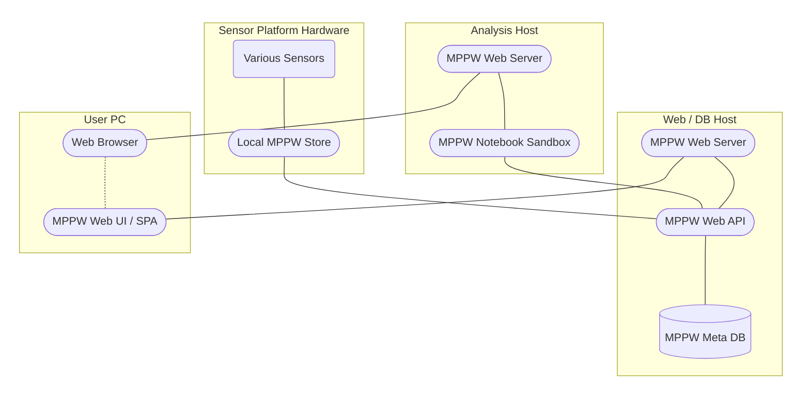

# Architecture

The MPPW platform is designed as an interface, in particular an API, to store and query metadata encoding relationships between manufacturing data.  To make this information as broadly accessible as possible, the software components form a standard [web stack](https://www.mongodb.com/developer/languages/python/farm-stack-fastapi-react-mongodb/) using Python for rapid development.  Web APIs are near-ubiquitous, easy to integrate with, usable in all OSes and all programming languages, easy to secure, and easy to "skin" with one or more complementary web UIs.  They can also be made highly performant.

<table style="text-align: center; font-weight: bold;">
  <tr>
    <td colspan="2">MPPW Web UI (Vue.js)</td>
    <td colspan="1">MPPW Notebook Sandbox (JupyterHub)</td>
  </tr>
  <tr>
    <td colspan="3" style="font-size: 1.5em;">MPPW Web API (FastAPI)</td>
  </tr>
  <tr>
    <td style="padding-left: 4em; padding-right: 4em;">MPPW Meta DB / Default Store (MongoDB)</td>
    <td style="color: gray;">Secondary Store (MongoDB, etc.)</td>
    <td style="color: gray;">Secondary Store (...)</td>
  </tr>
</table>

The stack diagram above shows the MPPW API abstracting details about data and metadata storage away from users of the API.  Each service depicted is containerized (aside from the API and UI, which are hosted together), providing multiple deployment options described below.

> In the future, we may want to provide secure mechanisms for the API to redirect to direct data store access - this may be more efficient when on-premise or otherwise local storage is used.

## Recommended Deployments

To be usable, each service in the stack must be deployed on a container host - one recommended configuration is here:

As can be seen, the API and database containers are deployed together on a single host, while the JupyterHub notebook server lives on a different host, preventing denial-of-service issues during user sandbox computations.  Users use a web browser to access the warehouse and notebook server via the included (Nginx) web server, which provides HTTPS termination for security.

The MPPW Web UI is written as a single-page-(web)-application ([SPA](https://en.wikipedia.org/wiki/Single-page_application)) in Vue.js - this means that the application is downloaded in its entirety to a user's browser as Javascript code and the code runs entirely on user hardware.  The SPA design ensures that any functionality a user invokes from the UI is driven with data from the API - in other words, anything you can do in the UI, you can automate.

Finally, described further in the [data integration](./data_integration/sensor_data.md) docs, data from the sensor platform is ingested via the MPPW API, optionally from some kind of local sensor store.  Direct database connections can be used as well, and were necessary prior to building time series and point cloud APIs, but is now deprecated when the API itself supports ingestion.

> Best practice is to isolate the API and database on different hardware - this is currently possible but not supported directly by our deployment scripts.