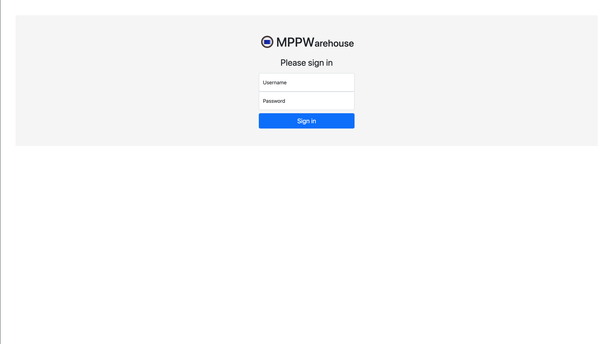
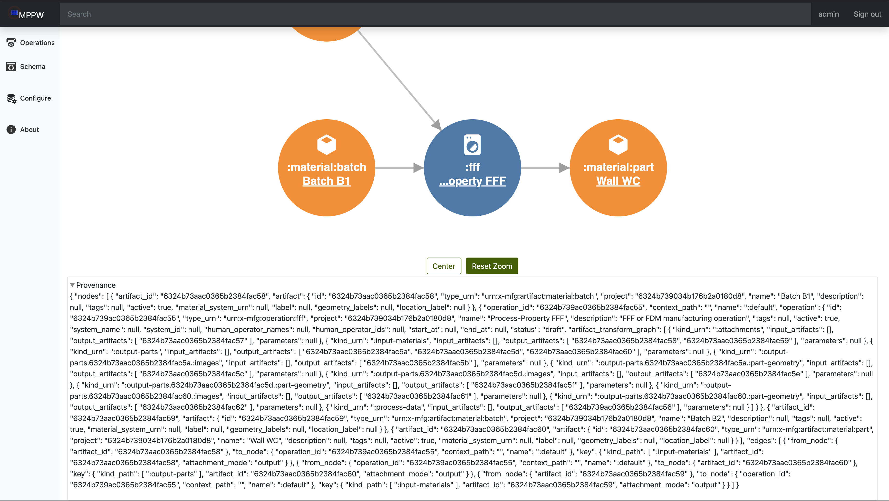
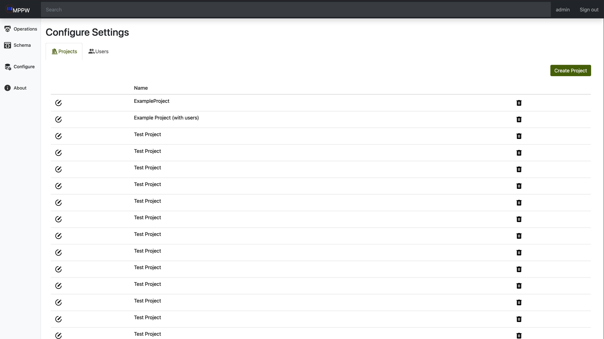
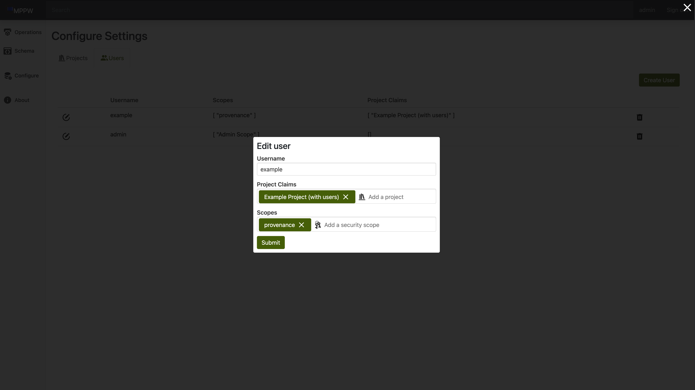

# Login page
`url`: http://localhost:8000/ui/index.html#/

This will be the default page for users who are not signed in. There is a 
  username and password field used for signin. A successful login will redirect 
  the user to the Browse operations view.

# Site Navigation

## Top Nav
At the top of the site is a navigation bar that features three key elements. 
From left to right they are the site logo (which returns to the "browse 
operations" view when clicked), search bar (TODO: does it work?), and sign 
out button. 

## Side Nav
On the left-hand side of the screen is a navigation column that lets the user 
access the different views across the application. The links in this side bar
take the user to the four main views across the application. The links and their
associated views are:
- `Operations`: Browse Operations view
- `Schema`: Browse Schema view
- `Configure`: Configure Settings view
- `About`: MPPW Deployment release notes

# Browse Operations View
`url`: http://localhost:8000/ui/index.html#/

This acts as the landing page for the site once the user is logged in.

First the user will need to select a project from the dropdown which will 
  display all the associated operations on that project, as well as allow the  
  user to create new operations.

clicking the new operation button will open the Create Operation view which 
  has fields for operation name, description, and type. By default, several 
  types are included on MPPW, however a user can create their own through the 
  Browse Schema view and then will be available here.

There are several filters available to find operations in larger projects: 
  Type, Status, and name.

Each operation row has 5 columns:
- `Type`: an icon denoting the type of operation (the type name can be displayed 
  by hovering over the icon)
- `Status`: The status of the operation, i.e. draft
- `Name`: The name of the operation, with a link to view the operation 
  itself.
- `Start`: the start time of the operation
- `End`: the end time of the operation

# Operation Details Page

`url`: http://localhost:8000/ui/index.html#/operations/{operation_id}

This view is split between two parts: 
- `Operation details`, which cover basic properties that are common to all 
  operations such as name, date, and tags
- `Artifacts`, which is a list of all associated artifacts on the operation, for 
  example all :input-materials will be group together under a :input-materials 
  header.

## Artifact View
By default all artifacts start collapsed, and can be expanded for more info. 

Each artifact has five buttons in the collapsed view:
- `Edit`: denoted by a pencil in a circle, this will open the Artifact Edit view 
  which allows the user to change the artifact name, description, and tags.
- `Provenance`: Denoted by a graph icon, this will open the Provenance view for 
  the associated artifact.
- `JSON`: denoted by open and closed curly braces, clicking on this icon will 
  console.log the associated json of the artifact. Hovering will also display 
  this info in a tooltip.
- `Collapse` toggle: Denoted by an up/down carrot icon, clicking this icon will 
  expand or close the artifact, displaying additional information.
- `Delete`: Denoted by a trashcan, this icon will delete the artifact from the 
  operation. There is a confirmation prompt after clicking this to ensure none 
    are deletated by accident.

If the artifact belongs to a different operation, there will be three new 
  buttons:
- `Operation Link`: Denoted by a hyperlink icon, clicking this button will 
  redirect the user to the operation which owns that artifact.
- `Claim Artifact`: Denoted by a dashed circle with a cursor on it, clicking 
  this button will set the current operation as the artifact's owner.
- `Destroy Link`: Denoted by a red hyperlink icon with a slash through it, this 
  replaces the delete artifact button. This will remove it from the operation,
  but leave the artifact itself alone since it belongs to a different 
  operation.

The detailed view of an artifact depends heavily on the artifact type. 
  (get list and show current things available)
  

# Provenance/Artifact Details Page
`url`: http://localhost:8000/ui/index.html#/artifacts/{artifact_id}

This page has three sections:
 - The JSON data of the artifact
 - A visualization of the provenance as a a directed acyclic graph (DAG)
 - The JSON data of the Provenance

## Provenance

The provenance DAG is the only section expanded by default and functions to 
show how the artifact relates to other artifacts and operations in the project. 

### Controls
- At the bottom of the DAG, there are buttons that allow the user to center the 
  DAG, and to reset the zoom so the whole dag is visible.
- By clicking and dragging, the user can move the DAG on the page.
- By scrolling or draggin with two fingers on a trackpad, the user can zoom in 
  or out on the DAG

### Nodes
As each node has a limited amount of space, they use color, icons, and short 
pieces of text to describe itself as quick as possible:
- `color`: TODO Explain colors. I believe the colors on the DAG simply 
  alternate for easier readability, but I need to confirm this.
- `icons`: TODO explain icons. Originally I believed that washing machine 
  represented the operations, and cubes the artifacts, but this seems incorrect. 
- `type`: The first line of text shows part of the operation/artifact type. For 
  example, an operation with the type `urn:x-mfg:operation:fff` will only show 
  `:fff` or an artifact with the type: `urn:x-mfg:artifact:digital:mesh` will 
  only show `digital:mesh`. If even this shortened form is too large for the 
  node, it will show the tail of the type and the full type name will be 
  available on hover.
- `Artifact ID/Operation Name`: The last line of the node will be different 
  between artifacts and operations. Operations will have the operation name 
  shown, while artifacts will display their ID. This line is a hyper link, and 
  if clicked on, will send the user to Operation details page or 
  Provenance/Artifact Details page of the node they clicked on.

## Artifact

This section is at the top of the page and can be expanded by clicking anywhere 
on the `> Artifact` row. It displays all the related JSON for the artifact, 
allowing the user to see useful details such as the ProjectID, its type, and so 
on.

## Provenance JSON

This section is at the top of the page and can be expanded by clicking anywhere 
on the `> Provenance` row. This is the JSON data used to construct the DAG 
shown above it. 

# Browse Schema Page
`url`: http://localhost:8000/ui/index.html#/schema

On this view, the user can select a project and access all the current 
  available operation/artifact schemas as well as create new ones.

To select a project, select the dropdown and select your desired project. 
  This will display all the associated schemas.

Each schema row has 6 six columns:
- `edit`: denoted by an icon of a pencil in a circle, this will open the 
  associated schema and allow the user to edit it. 
- `copy`: denoted by an icon of two sheets of paper, this will use the schema 
  as a template for a new schema.
- `type`: lists the schema type, which in turn helps describe the schema
- `name`: a human readable name that will be shown when adding the schema to the
  project.
- `source`: lists the schema source (i.e. mppw or user)
- `delete`: denoted by a trashcan icon, this allows the user to delete the 
  schema. It is only available for user-made schemas.

Clicking on the edit, copy, or new operation/artifact schema buttons will all 
open the schema editor view. This is a textfield holding a json object 
describing the schema. This is heavily customizable to define nearly any 
possible artifact/operation.

# Configure Page
`url`: http://localhost:8000/ui/index.html#/config

The configuration view presents the user with two tabs, one for editing 
project metadata the other for editing user metadata. 

## Project Configuration Tab

Beginning with the project configuration tab, there is a large table that holds 
references to all existing projects. In each row of the table there is an 
edit button that opens a dialog for changing the project name and description. 
Additionally, each row features a delete button that allows for the 
removal of a project. In addition to the table of projects there is a `create 
project` button that opens a dialog to create a new project. A new project 
may be created by simply supplying a name and optionally a description.

## User Configuration Tab

On the user configuration tab, there is a large table that holds 
references to all existing users. In each row of the table there is an 
edit button that opens a dialog for changing the username, associated projects,
and permissions. 

# About Page

`url`: http://localhost:8000/ui/index.html#/about

The about view displays the list of feature changes and improvements that 
have been introduced with each subsequent release of the MPPW software. The 
notes provide context and help keep users apprised of new features and fixes 
that have been applied.

