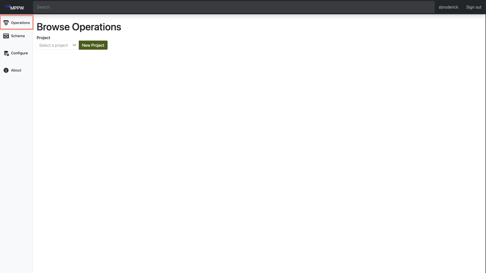
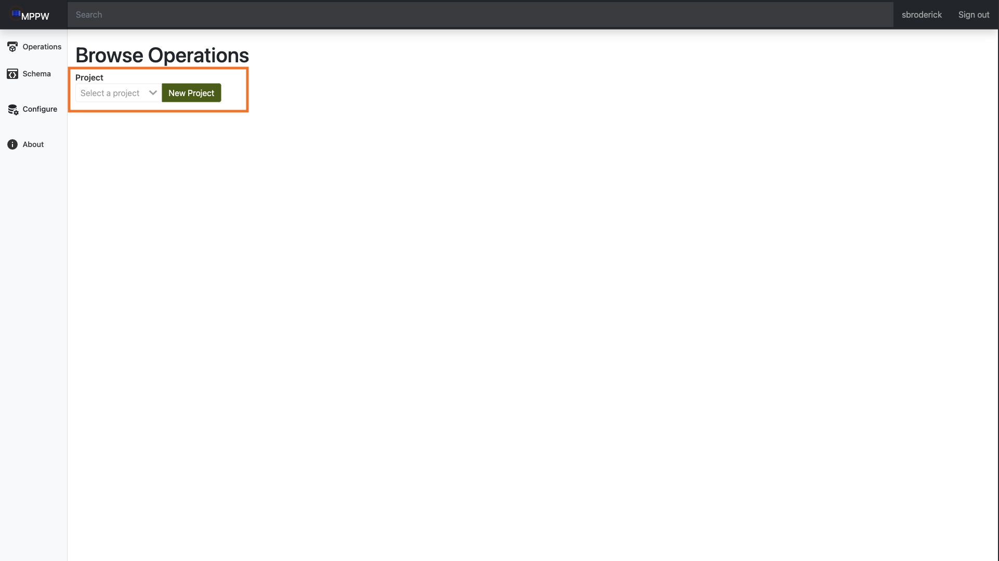
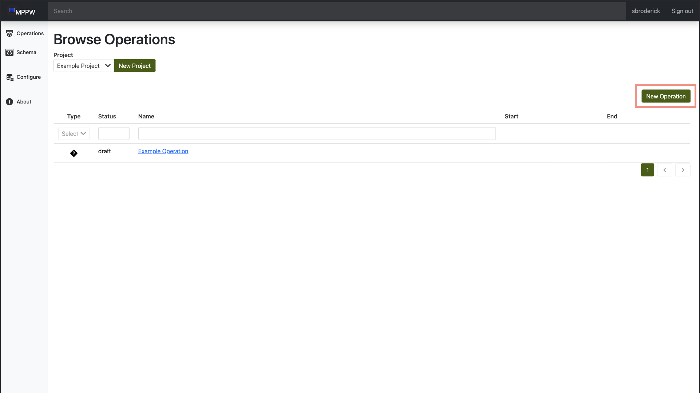
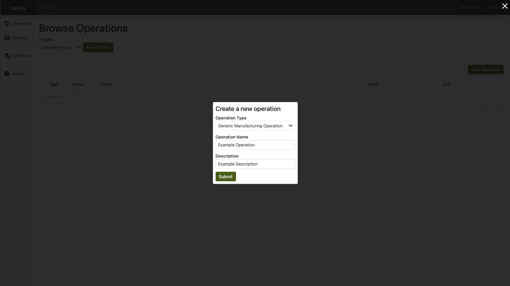

# Add Operations

- Navigate to the site and login.
- Select `Operations` on the side navigation to open the `Browse Operations` page. 

- Using the dropdown, select the project you would like to add an operation to.

  - If the project does not exist yet, click the `new project` button to the right of the dropdown. This will open a prompt allowing you to name and describe the project. After that, it will be available in the dropdown for project selection.
- Use the `New Operation` button on the right to open a prompt allowing you to name and describe the operation, as well as select the `operation type` from the dropdown.

  - If you would like to use a operation type not included here, selecting `schema` on the side nav will allow you to go and create your own operation type.
- Once you hit `submit`, your operation will be created and added to the project. To see more, click on the operation name to open  the operation details page.
