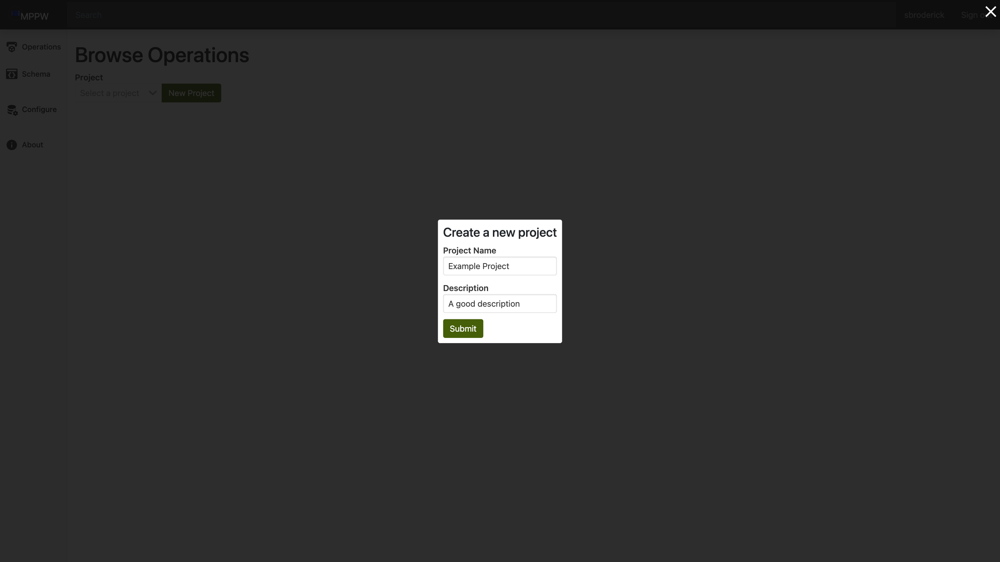

# Create a Project

- Navigate to the site and login.

- Select `Operations` on the side navigation to open the `Browse Operations` page. 

- Click the `new project` button to the right of the dropdown. 

- Fill out the form with your new project's details and hit submit. 

- It will now be available in the project selection dropdown.