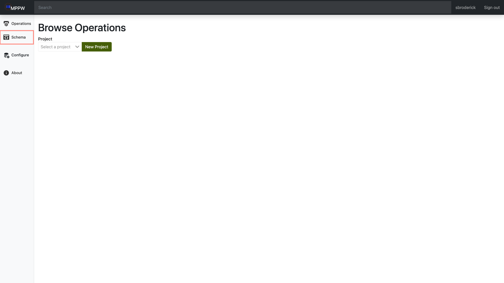
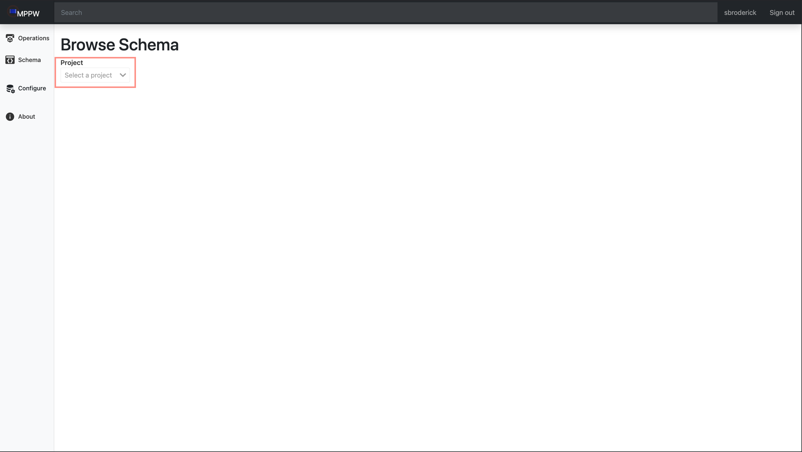
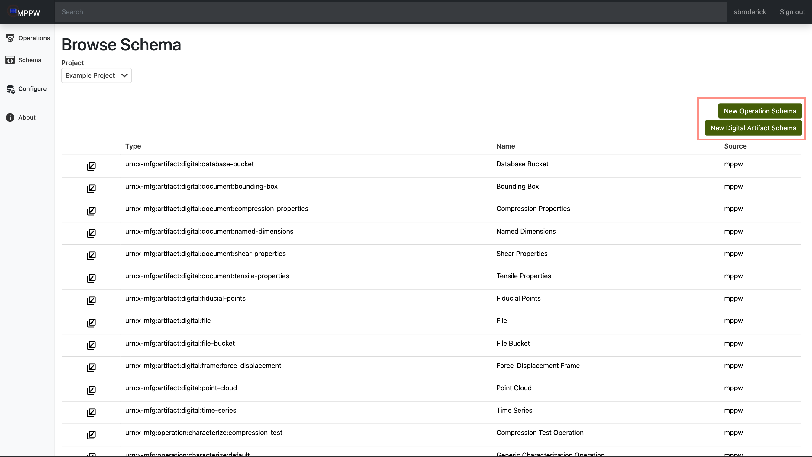
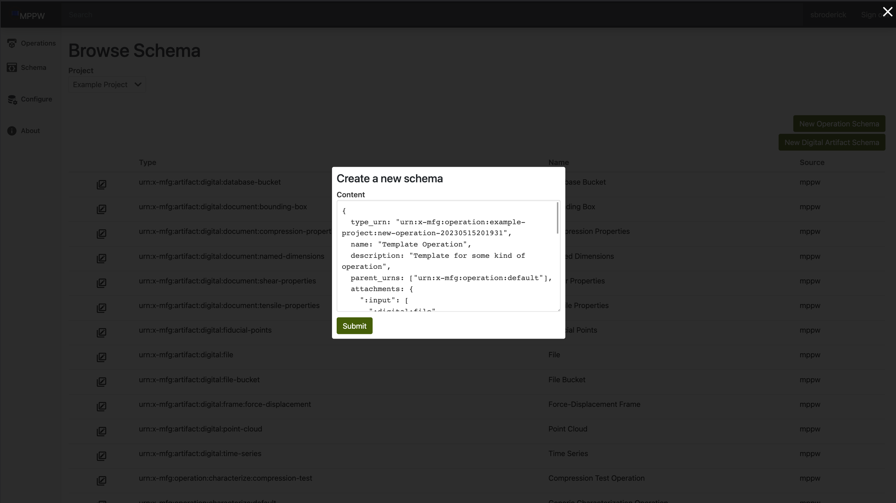
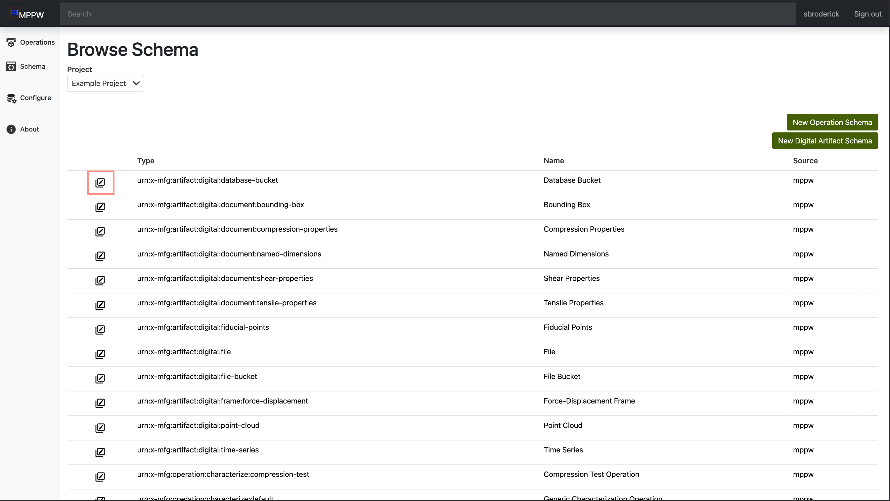
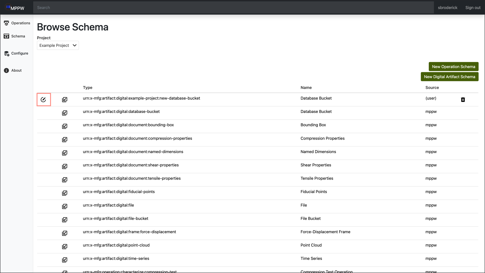
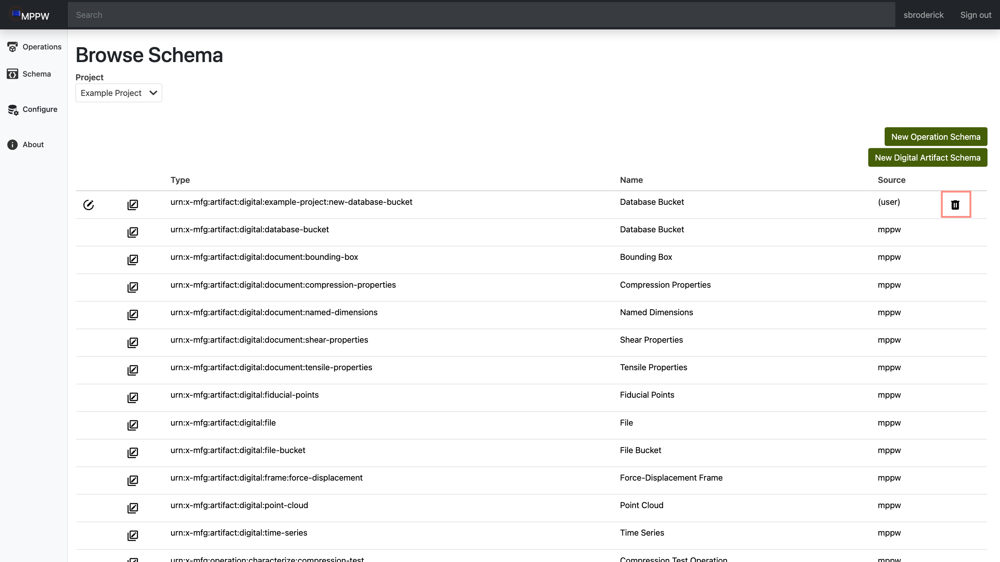

# Modify Schema

- Navigate to the site and login.

- Select `Schema` on the side navigation to open the `Browse Schema` page. 

- Select the your project from the dropdown. 

## Create a new Schema

- Click on either new operation or new artifact to open the schema creation prompt. 

- This will open the `Schema Creation` prompt. 

  - This area is a heavily customizable JSON object, but the following are a few
    general fields:
     - `type_urn`: This is the **Uniform Resource Name** for the type of schema
                 being created. For example, a customized manufacturing 
                 operation for the project **Example Project** might be 
                 something like 
                 **urn:x-mfg:operation:example-project:my-new-operation**
     - `name`: This is the more human readable name that will show up in most
             places. In the case of our example operation, it might be something
             like **My New Operation**
     - `description`: This allows you to describe your new operation. For our 
                    example, our description could be 
                    **A manufacturing operation that does xyz.**
     - `parent_urns`: These are schemas that your new schema builds off of, 
                    for our example, it would be 
                    **urn:x-mfg:operation:default**.
     - `attachments`: This is another json object and is customizable. For ours,
                    we have a input file and output text file:
                    
            attachments: {
                ":input": [":digital:file"],
                ":output": [":digital:text"],
            }
                    
     - `provenance`: This field describes where our new schema falls in the 
                   current workflow. For our new operation, we want to take in
                   all input artifacts and deliver output artifacts.
                   
            provenance: {
                steps: [
                    {
                        from_artifacts: [":input.*"],
                        to_artifacts: [":output.*"],
                    }
                ]
            }

## Create a New Schema Using an Existing Template

- This works nearly exactly like creating a new `schema`, only the beginning is 
  different. In order to do this, instead of using the `New Schema` buttons on
  the right, click on the `copy` button next to the schema you would like to use
  as the template (shown below).

- This opens the `Schema Creation` prompt like before, but now it is populated
  with the template's schema. Form here you can edit it to your liking and then
  hit `submit`.

## Modify Custom Schema

- On custom schemas you've created, you'll find two extra buttons available. The
  left icon is `Edit Schema` and the right is `Delete Schema`. In order to 
  modify your schema, click the `Edit Schema` button. This will open the same 
  prompt allowing you to edit modify the schema.

- Lastly, to delete one of your cutom operations, click on the `Delete Schema`
  button on the right. 

## Advanced Schema Options

Coming Soon!